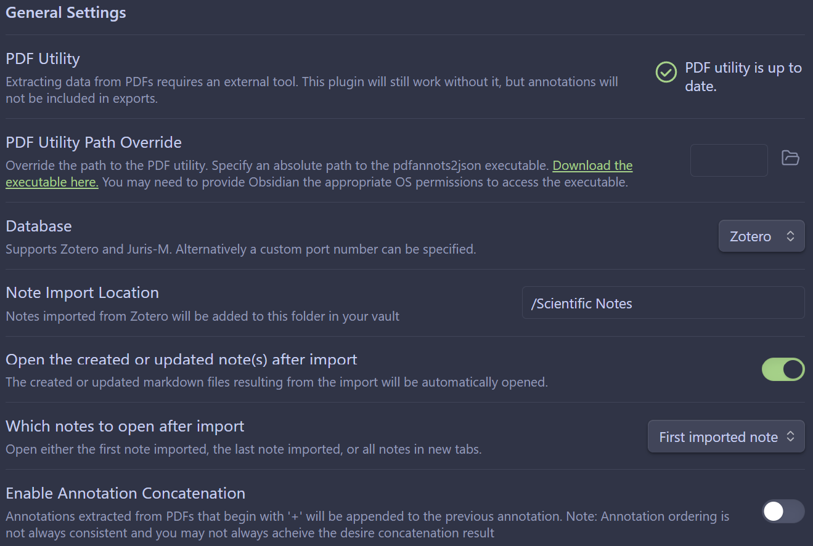
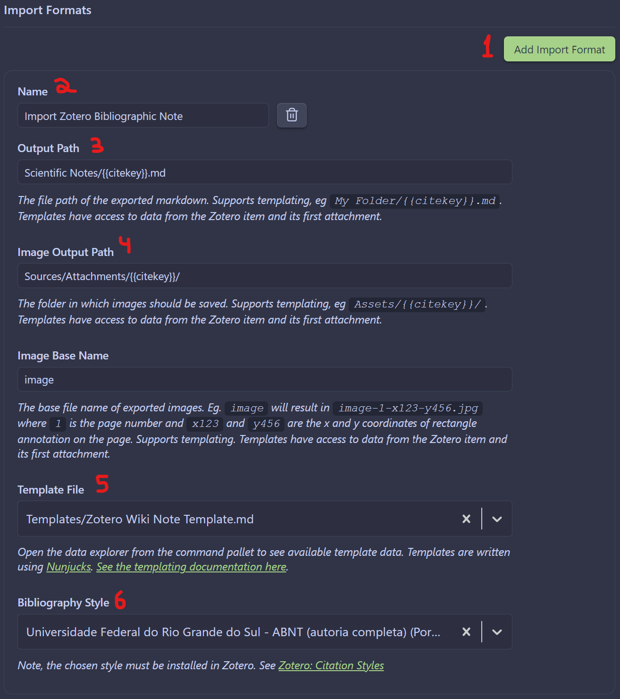

# Zotero Wiki Note
Ever wanted to recreate the style of Wikipedia in your academic notes? Well, now you can! 
## How it works
This template helps you import your Zotero highlights and comments to a new note formatted in the style of Wikipedia (infobox included) without the need of installing a specific theme or complex CSS schemes. 
## Requirements 
The template uses two Obsidian plugins (which you can install from the Community Plugins), but only one is required:
- [Zotero Integration](https://github.com/mgmeyers/obsidian-zotero-integration)
- [Auto Note Mover](https://github.com/farux/obsidian-auto-note-mover)

Using the Auto Note Mover plugin if more of a convenience so all your notes can be sent to a specific folder based on a trigger. If your system doesn't use folders you can skip it without a problem.
You also need to have installed the [Better BibTex](https://github.com/retorquere/zotero-better-bibtex) in Zotero, otherwise the Zotero Integration plugin won't work.
## How to configure
Import the template file to your vault and put the CSS file in the snippets folder (.obsidian/snippets/), then activate the CSS snippets in Appearance -> CSS snippets. If necessary, reload Obsidian.
### Zotero Integration
This is the most important part of this workflow; without proper configuration, Obsidian will not communicate with Zotero and your highlights/comments will no be imported. There are a couple of settings that needs to be set in the plugin. Starting in the General Settings, you must:
1. Ensure that the **PDF Utility reads** "PDF utility is up to date". The first time you open the settings this option will read "Download", so simply click on it and it should update.
2. Define where the note should be after being imported by changing the **Note Import Location**; if you use folders, here's the place where you can set the folder that will hold all the notes.

Once you have configured the General Settings, you must configure the Import Formats and you can do that in six steps:
1. Click **Add Import Format** to generate a new import format.
2. Define the **Name of the format** (this will be the name that will appear when you run the command to import the note from Zotero).
3. Define the **Output Path** to designate where the note will be saved; the template uses the {{citekey}} generated by Better BibTex to name the note.
4. Define the **Image Output Path** to designate where the images should be imported if you end up highlighting images in Zotero.
5. Select the **Template File**, which is the zotero-wiki-template.
6. Define the **Bibliography Style** to autogenerate the full citation in the template; you can change to whatever citation format you prefer but the format must be installed in Zotero, otherwise it won't work.

You can leave all other settings as default.
If you want to use the Auto Note Mover plugin you can find how to configure it [here](https://github.com/farux/obsidian-auto-note-mover).
## How to use
Once configured, the workflow is straightforward:
1. Start Zotero (it needs to be running so Obsidian can communicate with it).
2. Start Obsidian.
3. Open the Command Palette in Obsidian (Ctrl + P / Cmd + P).
4. Type the name of the format you defined in Zotero Integration settings and press Enter.
5. Select which file you are importing from Zotero in the pop-up and press Enter.
6. The note is imported to Obsidian.
And the result should be something like this:
[note1](screenshots/formatted_note_1.png)
[note2](screenshots/formatted_note_2.png)
## References
The infobox code was found in [Joshua Plunkket patreon page](https://www.patreon.com/posts/65804706) but the original creator of the infobox and CSS code is **SIRvb**, the creator of the ITS Theme. You can find the CSS codes from the repository [here](https://github.com/SlRvb/Obsidian--ITS-Theme/blob/main/Snippets/S%20-%20Callouts.css).
