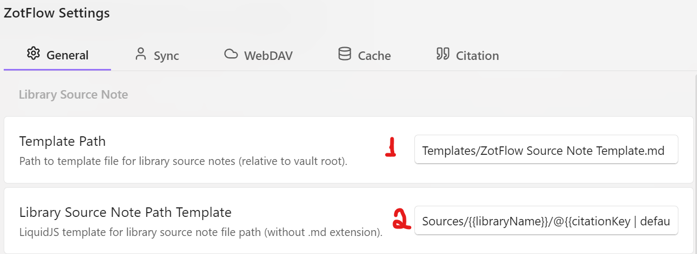
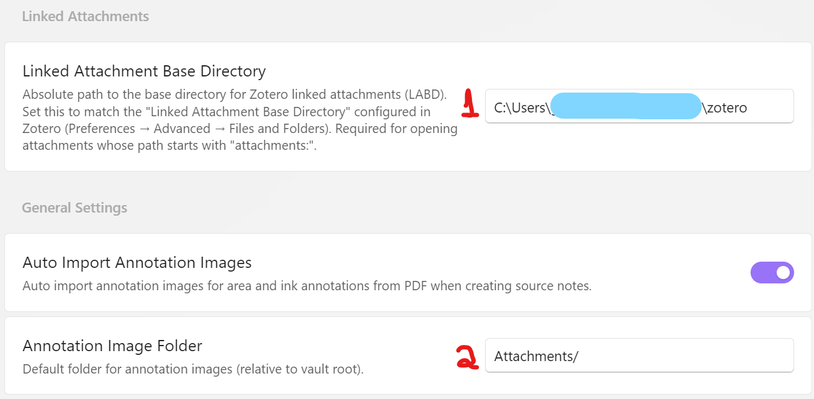
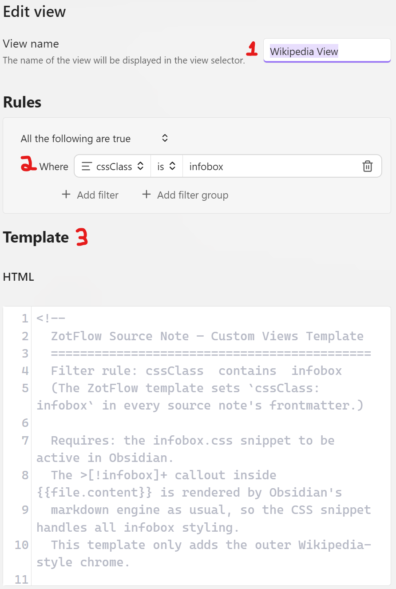
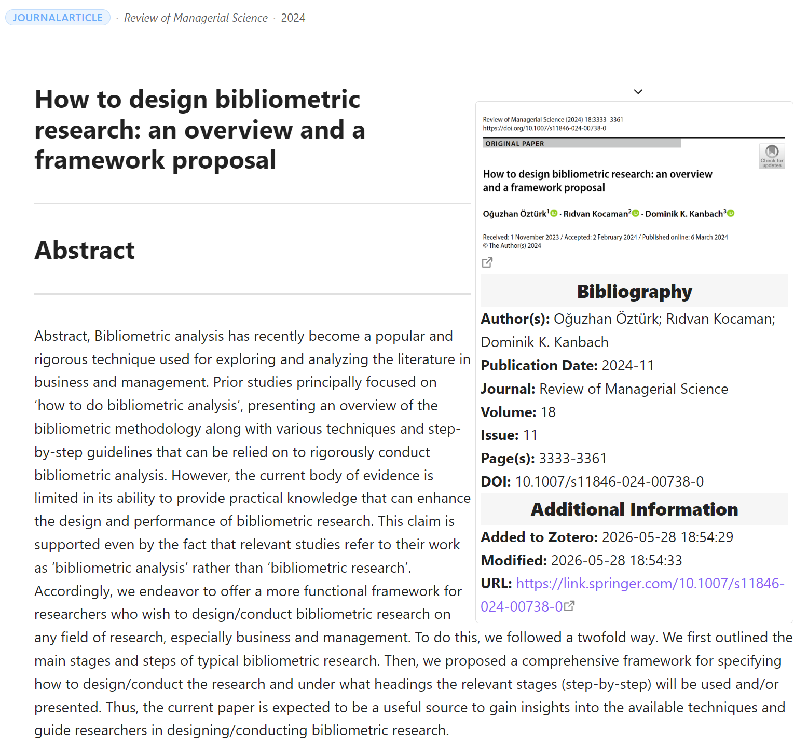
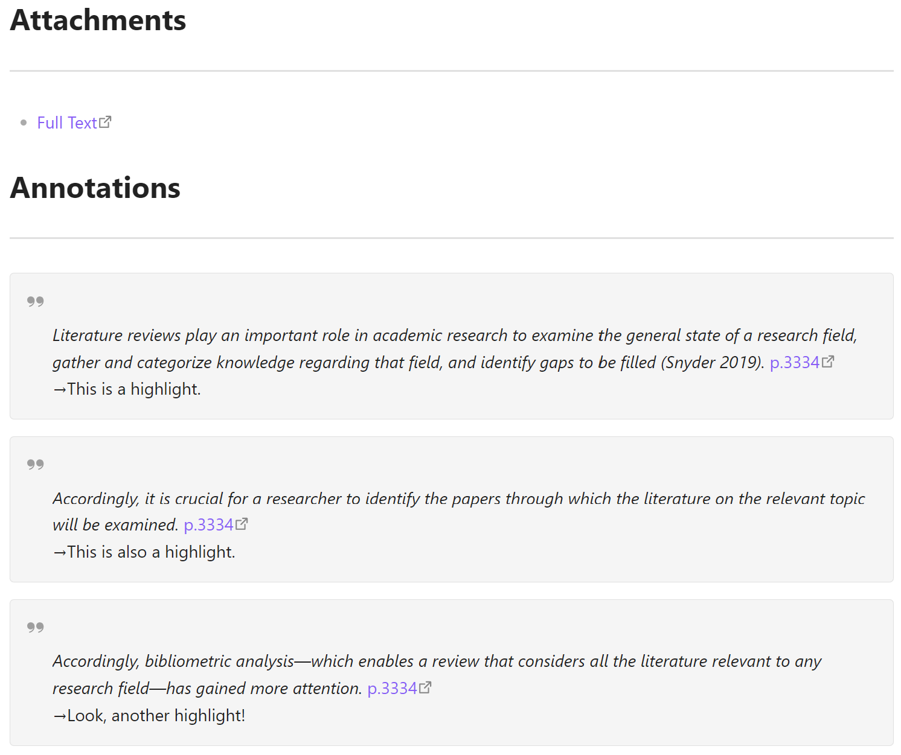
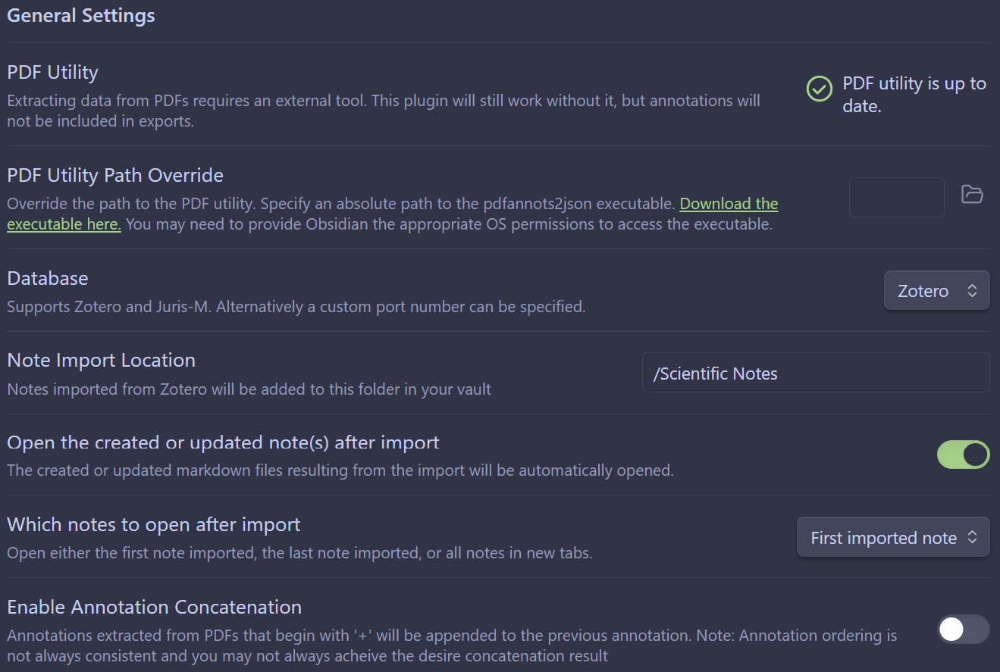
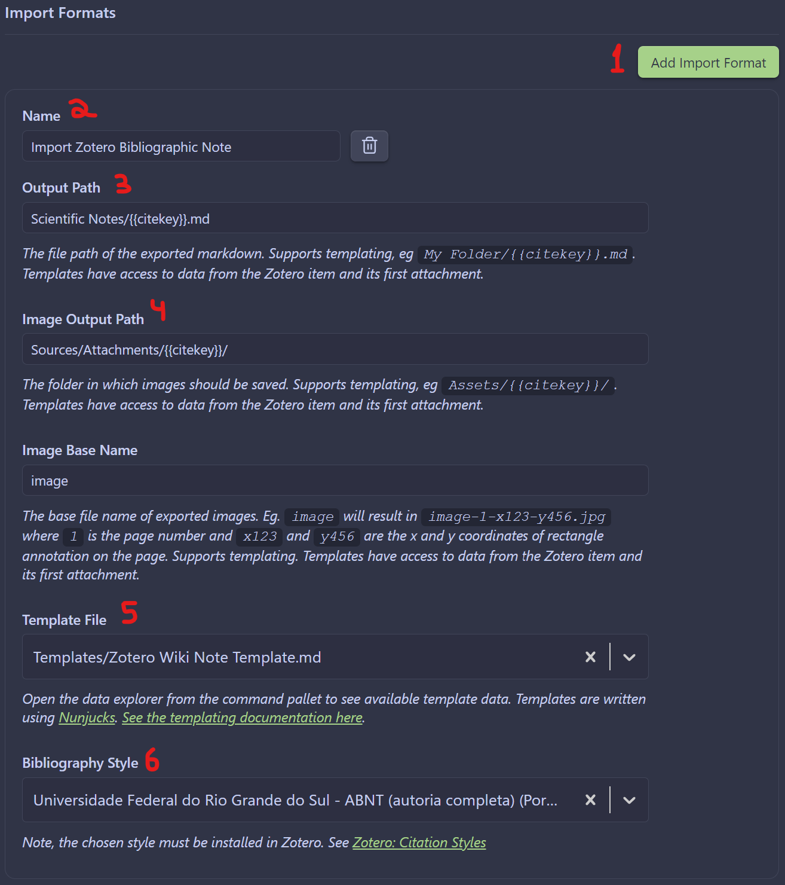
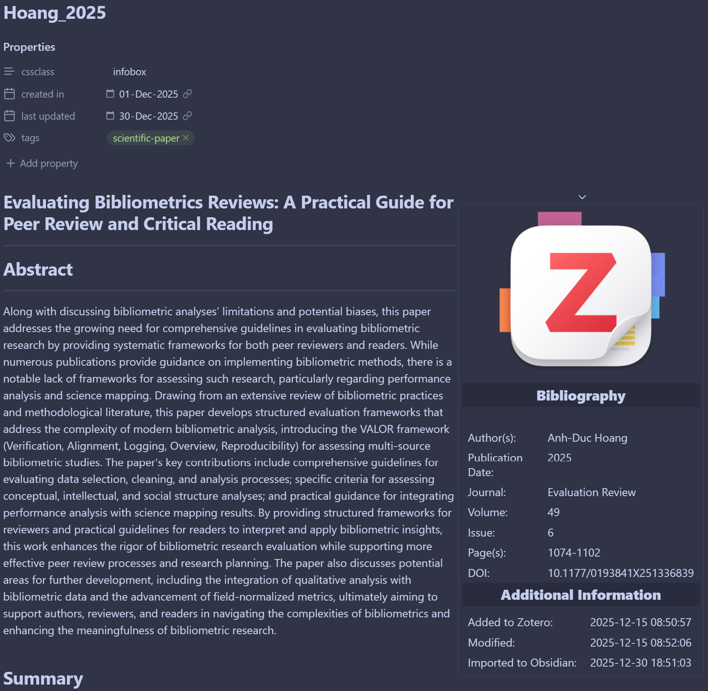
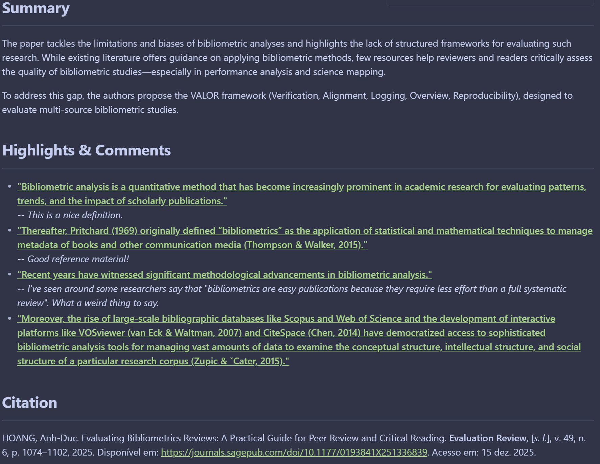

# Zotero Wiki Note
Ever wanted to replicate the style of Wikipedia in your academic notes? Well, now you can! 

⚠️ This repository contains two approaches. The one based on the Zotero Integration plugin (legacy method) is documented under the section "Legacy Method"; the new method is documented below.
## How it works
This template helps you import your Zotero highlights and comments to a new note formatted in the style of Wikipedia (infobox included) without the need of installing a specific theme or using a complex CSS schemes. The accompaning HTML file helps with configuring a custom view so the note can still preserve the "Wikipedia style" in the editor mode (originally, the CSS would only take effect in the Reader mode). 
## Requirements
The template uses two Obsidian plugins (which you can install from the Community Plugins):
- [ZotFlow](https://github.com/anupchavan/obsidian-custom-views)
- [Custom Views](https://github.com/anupchavan/obsidian-custom-views)

Also, you will need three additional files:
- ZotFlow Source Note Template.md is the template for the note (put it in your templates folder)
- infobox.CSS is the snippet that will add and correctly display the infobox in your notes (put it in the snippets folder)
- Wikipedia Style.html is the HTML file with the template for the Custom Views plugin (copy the contents to the Custom Views configuration tab)

## How to configure
Import the template file to your vault and put the CSS file in the snippets folder (.obsidian/snippets/), then activate the CSS snippets in Appearance -> CSS snippets. If necessary, reload Obsidian.

To configure ZotFlow you can follow the [guide of the plugin](https://github.com/duanxianpi/zotflow/blob/master/docs/getting-started.md). Once you have ZotFlow installed, configure it in Obsidian but don't synchronize with Zotero yet. You need to configure:
 - the source note template (add the file ZotFlow Source Note Template.md to your templates folder) by indicating to the plugin where the template folder is located (1).
 - where your library will be imported (the default is a folder called "Source" but mine is called "Sources") (2).

 

 - where the Linked Attachment Base Directory (LABD) from Zotero is located. (3)
 - where the attachments will be imported/saved (mine is on a folder called "Attachments"). (4)

 

You don't need to follow my advice if you already have ZotFlow installed and configured and your notes are already in Obsidian, but be aware that that ZotFlow will automatically import everything you have in Zotero on the first synchronization. If you already is using the plugin, remember to update/force update your notes (or simply generated them again) to see the template working. 

Once everything is set, all you need to do is configure the "Wikipedia style" (1, 2, and 3 on the figure below) in Custom Views using the template "Wikipedia Style.html" provided here. 

 

If you did everything correctly, any source note generated by ZotFlow can be opened in the editor mode and the style will be applied; switching to the reader mode will preserve the style also.
## How to use
Once the plugins are configured and ZotFlow synchronizes with Zotero, the workflow is straightforward:
1. Start Obsidian.
2. Open the Command Palette in Obsidian (Ctrl + P / Cmd + P) or click on the shortcut located in the left sidebar of Obsidian (it's a "Z" with a magnifying glass icon).
3. Type the title of the file and press Enter or click with the left mouse buttom.
5. The file will open inside Obsidian (it will be the same file viewer of Zotero).
6. Use the "Select Area" feature and select an image that you want to use as the thumbnail of the note (it will also be the image displayed in the infobox).
7. Start highlighting and annotating to your hearts content; the source note will automatically be generated by ZotFlow and update in real time.

If everything is configured, the result should be something like this:

If you switch to the reader mode the note will preserve the same layout, too. 

⚠️ **Attention**: the HTML template used with Custom Views hides the properties of the note in the editor mode but it can be reverted by 1) editing the HTML template (if you know how to do it) or 2) switching to the source mode.
# Legacy Method
## How it works
This template helps you import your Zotero highlights and comments to a new note formatted in the style of Wikipedia (infobox included) without the need of installing a specific theme or complex CSS schemes. 
## Requirements 
The template uses two Obsidian plugins (which you can install from the Community Plugins), but only one is required:
- [Zotero Integration](https://github.com/mgmeyers/obsidian-zotero-integration)
- [Auto Note Mover](https://github.com/farux/obsidian-auto-note-mover)

Using the Auto Note Mover plugin if more of a convenience so all your notes can be sent to a specific folder based on a trigger. If your system doesn't use folders you can skip it without a problem.
You also need to have installed the [Better BibTex](https://github.com/retorquere/zotero-better-bibtex) in Zotero, otherwise the Zotero Integration plugin won't work.
## How to configure
Import the template file to your vault and put the CSS file in the snippets folder (.obsidian/snippets/), then activate the CSS snippets in Appearance -> CSS snippets. If necessary, reload Obsidian.
### Zotero Integration
This is the most important part of this workflow; without proper configuration, Obsidian will not communicate with Zotero and your highlights/comments will no be imported. There are a couple of settings that needs to be set in the plugin. Starting in the General Settings, you must:
1. Ensure that the **PDF Utility reads** "PDF utility is up to date". The first time you open the settings this option will read "Download", so simply click on it and it should update.
2. Define where the note should be after being imported by changing the **Note Import Location**; if you use folders, here's the place where you can set the folder that will hold all the notes.

Once you have configured the General Settings, you must configure the Import Formats and you can do that in six steps:
1. Click **Add Import Format** to generate a new import format.
2. Define the **Name of the format** (this will be the name that will appear when you run the command to import the note from Zotero).
3. Define the **Output Path** to designate where the note will be saved; the template uses the {{citekey}} generated by Better BibTex to name the note.
4. Define the **Image Output Path** to designate where the images should be imported if you end up highlighting images in Zotero.
5. Select the **Template File**, which is the zotero-wiki-template.
6. Define the **Bibliography Style** to autogenerate the full citation in the template; you can change to whatever citation format you prefer but the format must be installed in Zotero, otherwise it won't work.

You can leave all other settings as default.
If you want to use the Auto Note Mover plugin you can find how to configure it [here](https://github.com/farux/obsidian-auto-note-mover).
## How to use
Once configured, the workflow is straightforward:
1. Start Zotero (it needs to be running so Obsidian can communicate with it).
2. Start Obsidian.
3. Open the Command Palette in Obsidian (Ctrl + P / Cmd + P).
4. Type the name of the format you defined in Zotero Integration settings and press Enter.
5. Select which file you are importing from Zotero in the pop-up and press Enter.
6. The note is imported to Obsidian.

And the result should be something like this:

## References
The infobox code was found in [Joshua Plunkket patreon page](https://www.patreon.com/posts/65804706) but the original creator of the infobox and CSS code is **SIRvb**, the creator of the ITS Theme. You can find the CSS codes from the repository [here](https://github.com/SlRvb/Obsidian--ITS-Theme/blob/main/Snippets/S%20-%20Callouts.css).
